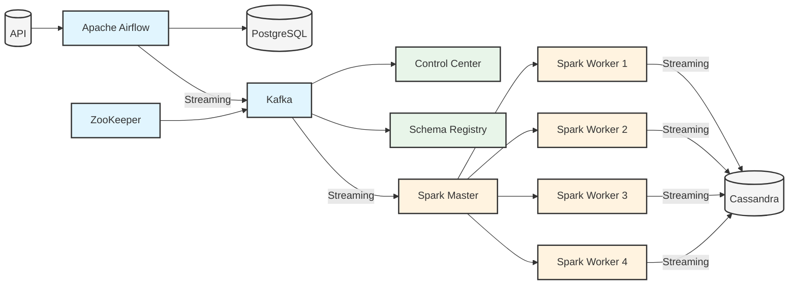

# Real-Time Data Streaming Pipeline 🚀

A comprehensive end-to-end data engineering project that demonstrates real-time data processing at scale.

## 🌟 Overview

Transform and process data in real-time using a modern data engineering stack. This project showcases a production-ready pipeline that handles data ingestion, processing, and storage using industry-standard tools and best practices.

## 🏗️ Architecture

Our pipeline consists of several key components working together:



### Component Breakdown
- **Data Ingestion**: Random user data from `randomuser.me` API
- **Workflow Management**: Apache Airflow with PostgreSQL backend
- **Stream Processing**: Apache Kafka + Zookeeper
- **Data Processing**: Apache Spark cluster
- **Storage**: Apache Cassandra
- **Monitoring**: Kafka Control Center + Schema Registry

## 🛠️ Tech Stack

| Category | Technologies |
|----------|-------------|
| Core Processing | Apache Airflow, Apache Spark |
| Streaming | Apache Kafka, Apache Zookeeper |
| Storage | PostgreSQL, Apache Cassandra |
| Containerization | Docker |
| Programming | Python |

## ✨ Features

- Real-time data streaming and processing
- Fault-tolerant architecture
- Scalable design
- Docker containerization
- Monitoring and schema management
- Automated workflow orchestration

## 📋 Prerequisites

- Python 3.11
- Docker and Docker Compose
- Minimum 16GB RAM recommended
- 50GB free disk space

## 🚀 Quick Start

1. **Set Up Environment**
   ```bash
   # Create and activate conda environment
   conda create -n data-pipeline python=3.11
   conda activate data-pipeline
   ```

2. **Install Dependencies**
   ```bash
   # Core dependencies
   pip install apache-airflow kafka-python cassandra-driver spark pyspark
   ```

3. **Configure Credentials**
   ```bash
   # Airflow credentials
   Username: admin
   Password: admin
   ```

4. **Launch Services**
   ```bash
   # Clone repository
   git clone https://github.com/Shaabanm2018/ETL-Data-Streaming-Project.git
   cd e2e-data-engineering

   # Start services
   docker-compose up -d
   ```

## 🔍 Service URLs

| Service | URL | Description |
|---------|-----|-------------|
| Airflow | http://localhost:8080 | DAG management |
| Control Center | http://localhost:9021 | Kafka monitoring |
| Spark Master | http://localhost:8081 | Spark management |

## 📸 System Screenshots & Results

### Apache Airflow Dashboard


*Apache Airflow Login Screen*


*Apache Airflow DAGs showing our data pipeline workflows*

### Kafka Control Center


*Kafka Control Center showing active topics and throughput*


*Real-time monitoring of data streams*

### Apache Cassandra Results


## 📦 Project Structure

```
ETL-Data-Streaming-Project/
├── airflow/
│   ├── dags/
│   └── logs/
├── kafka/
│   └── config/
├── spark/
│   └── apps/
├── cassandra/
│   └── data/
└── docker-compose.yml
```

⭐ Don't forget to star this repo if you found it helpful!
