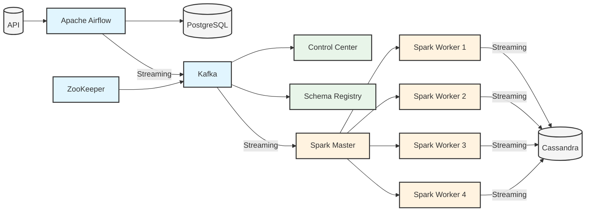

```mermaid
flowchart LR
    api[("API")]
    pg[(PostgreSQL)]
    af[Apache Airflow]
    zk[ZooKeeper]
    kf[Kafka]
    cc[Control Center]
    sr[Schema Registry]
    spark_master[Spark Master]
    w1[Spark Worker 1]
    w2[Spark Worker 2]
    w3[Spark Worker 3]
    w4[Spark Worker 4]
    cass[(Cassandra)]

    api --> af
    af --> pg
    af -- "Streaming" --> kf
    zk --> kf
    kf --> cc
    kf --> sr
    kf -- "Streaming" --> spark_master
    spark_master --> w1
    spark_master --> w2
    spark_master --> w3
    spark_master --> w4
    w1 -- "Streaming" --> cass
    w2 -- "Streaming" --> cass
    w3 -- "Streaming" --> cass
    w4 -- "Streaming" --> cass

    classDef database fill:#f5f5f5,stroke:#333,stroke-width:2px
    classDef service fill:#e1f5fe,stroke:#333,stroke-width:2px
    classDef monitoring fill:#e8f5e9,stroke:#333,stroke-width:2px
    classDef worker fill:#fff3e0,stroke:#333,stroke-width:2px

    class api,pg,cass database
    class af,zk,kf service
    class cc,sr monitoring
    class w1,w2,w3,w4,spark_master worker
```
